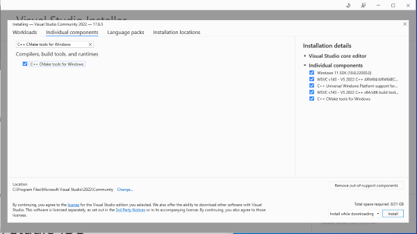
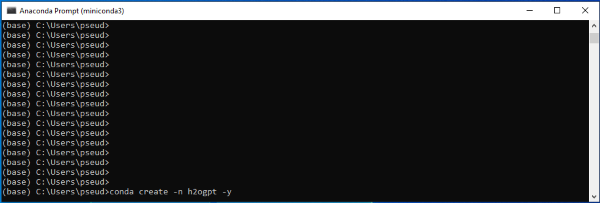

# Windows 10/11

If using GPU on Windows 10/11 Pro 64-bit, we recommend using [Windows installers](../README.md#windows-1011-64-bit-with-full-document-qa-capability).  This excludes DocTR and PlayWright support. 

For newer builds of windows versions of 10/11.

- [Install](#install)
- [Run](#run)

## Install
* Download Visual Studio 2022: [Download Link](https://visualstudio.microsoft.com/vs/community/)
  * Run Installer, click ok to run, click Continue
  * Click on `Individual Components`
  * Search for these in the search bar and click on them:
     * `Windows 11 SDK` (e.g. 10.0.22000.0)
     * `C++ Universal Windows Platform support` (e.g. for v143 build tools)
     * `MSVC VS 2022 C++ x64/x86 build tools` (latest)
     * `C++ CMake tools for Windows`
     * 
  * Click Install, and follow through installation, and do not need to launch VS 2022 at end.
* Download the MinGW installer: [MiniGW](https://sourceforge.net/projects/mingw/)
  * Run Installer, Click Install, Continue, Install/Run to launch installation manager.
  * Select packages to install:
     * minigw32-base
     * mingw32-gcc-g++
     * 
  * Go to installation tab, then apply changes.
* Download and install [Miniconda](https://docs.conda.io/projects/conda/en/latest/user-guide/install/windows.html)
* Run Miniconda shell (not powershell!) as Administrator
* Run: `set path=%path%;c:\MinGW\msys\1.0\bin\` to get C++ in path.  In some cases it may be instead correct to use `set path=%path%;c:\MinGW\bin\`
* Download latest nvidia driver for windows if one has old drivers before CUDA 11.7 supported
* Confirm can run `nvidia-smi` and see driver version
* Setup Conda Environment:
    * 
   ```bash
    conda create -n h2ogpt -y
    conda activate h2ogpt
    conda install python=3.10 -c conda-forge -y
    python --version  # should say python 3.10.xx
    python -c "import os, sys ; print('hello world')"  # should print "hello world"
    ```
* GPU Only: Install CUDA
   ```bash
    conda install cudatoolkit=11.7 -c conda-forge -y
    set CUDA_HOME=$CONDA_PREFIX
    ```
* Install Git:
   ```bash
    conda install -c conda-forge git
    ```
* Install h2oGPT:
   ```bash
    git clone https://github.com/h2oai/h2ogpt.git
    cd h2ogpt
    ```
* Prepare to install dependencies:
   ```bash
   set PIP_EXTRA_INDEX_URL="https://download.pytorch.org/whl/cu118"
   ```
  Choose cu118+ for A100/H100+.  Or for CPU set
   ```bash
   set PIP_EXTRA_INDEX_URL="https://download.pytorch.org/whl/cpu"
   ```
* Install primary dependencies.
  * Remove any bad dependencies that existed (required for new transformers it seems):
      ```bash
      pip uninstall flash-attn
      pip install -r requirements.txt
       ```
 * Optional: for bitsandbytes 4-bit and 8-bit:
   ```bash
   pip uninstall bitsandbytes -y
   pip install https://github.com/jllllll/bitsandbytes-windows-webui/releases/download/wheels/bitsandbytes-0.41.1-py3-none-win_amd64.whl
   ```
   Bitsandbytes can be uninstalled (`pip uninstall bitsandbytes`) and still h2oGPT can be used if one does not pass `--load_8bit=True`.
  When running windows on GPUs with bitsandbytes in 8-bit you should see something like the below in output:
  ```bash
  bin C:\Users\pseud\.conda\envs\h2ogpt\lib\site-packages\bitsandbytes\libbitsandbytes_cuda117.dll
  ```
* Install document question-answer dependencies

   Prefix each pip install with `--extra-index-url https://download.pytorch.org/whl/cu118` for GPU install:
   ```bash
    # Required for Doc Q/A: LangChain:
    pip install -r reqs_optional/requirements_optional_langchain.txt
    # Required for CPU: LLaMa/GPT4All:
    pip install -r reqs_optional/requirements_optional_gpt4all.txt
    # Optional: PyMuPDF/ArXiv:
    pip install -r reqs_optional/requirements_optional_langchain.gpllike.txt
    # Optional: Selenium/PlayWright:
    pip install -r reqs_optional/requirements_optional_langchain.urls.txt
    # Optional: for supporting unstructured package
    python -m nltk.downloader all
    # Optional but required for PlayWright
    playwright install --with-deps
    # Note: for Selenium, we match versions of playwright so above installer will add chrome version needed
  ```
* AutoGPTQ support:
   ```bash
    pip uninstall -y auto-gptq
    # GPU
    pip install auto-gptq==0.6.0 --extra-index-url https://huggingface.github.io/autogptq-index/whl/cu118/
    # or CPU
    pip install auto_gptq==0.6.0
    # in-transformers support of AutoGPTQ, requires also auto-gptq above to be installed since used internally by transformers/optimum
    pip install optimum==1.16.1
   ```
* AutoAWQ support:
   ```bash
    pip uninstall -y autoawq
    pip install autoawq==0.1.8
   ```
* Exllama support (GPU only):
    ```bash
    pip uninstall -y exllama
    pip install https://github.com/jllllll/exllama/releases/download/0.0.18/exllama-0.0.18+cu118-cp310-cp310-win_amd64.whl --no-cache-dir
    ```
* GPU Optional: Support attention sinks for infinite generation
  ```bash
  pip install attention_sinks --no-deps
  ```
* SERP for search:
  ```bash
  pip install -r reqs_optional/requirements_optional_agents.txt
  ```
  For more info see [SERP Docs](README_SerpAPI.md).
* For supporting Word and Excel documents, if you don't have Word/Excel already, then download and install libreoffice: https://www.libreoffice.org/download/download-libreoffice/ .
* To support OCR, download and install [tesseract](https://github.com/UB-Mannheim/tesseract/wiki), see also: [Tesseract Documentation](https://tesseract-ocr.github.io/tessdoc/Installation.html).  Please add the installation directories to your PATH.
* vLLM support:
  ```bash
  pip install https://h2o-release.s3.amazonaws.com/h2ogpt/openvllm-1.3.7-py3-none-any.whl
  ```
* PDF Viewer support (only if using gradio4):
  ```bash
  #pip install https://h2o-release.s3.amazonaws.com/h2ogpt/gradio_pdf-0.0.3-py3-none-any.whl
  ```
* TTS and STT support (no Coqui support):
  ```bash
  pip install pydub==0.25.1 librosa==0.10.1 ffmpeg==1.4 yt_dlp==2023.10.13 wavio==0.0.8
  pip install playsound==1.3.0
  pip install torchaudio soundfile==0.12.1
  ```
---

Note models are stored in `C:\Users\<user>\.cache\` for chroma, huggingface, selenium, torch, weaviate, etc. directories.  For an absolute windows path, choose `--user_path=C:\Users\YourUsername\h2ogpt` or something similar for some user `YourUsername`.  If the model is using the GPU, in `nvidia-smi` or some other GPU monitor program you should see `python.exe` using GPUs in `C` (Compute) mode and using GPU resources.  Use `set CUDA_VISIBLE_DEVICES=0` to pick first model, since llama.cpp models cannot choose which GPU otherwise.

See [FAQ](FAQ.md#adding-models) for how to run various models.  See [CPU](README_CPU.md) and [GPU](README_GPU.md) for some other general aspects about using h2oGPT on CPU or GPU, such as which models to try, quantization, etc.

## Issues
* llama_cpp_python with GGUF support for llama.cpp models should be installed correctly for avx2 or CUDA systems.  Change `reqs_optional/requirements_optional_gpt4all.txt` by commenting out avx2 if you don't have it.  Or download one from [CUDA llama-cpp-python wheel](https://github.com/jllllll/llama-cpp-python-cuBLAS-wheels) or [https://github.com/abetlen/llama-cpp-python/releases](https://github.com/abetlen/llama-cpp-python/releases).
  * If any issues, then must compile llama-cpp-python with CUDA support:
    ```bash
    pip uninstall -y llama-cpp-python
    set LLAMA_CUBLAS=1
    set CMAKE_ARGS=-DLLAMA_CUBLAS=on
    set FORCE_CMAKE=1
    pip install llama-cpp-python==0.2.23 --no-cache-dir --verbose
    ```
* SSL Certification failure when connecting to Hugging Face.
  * Your org may be blocking HF
  * Try: https://stackoverflow.com/a/75111104
  * Or try: https://github.com/huggingface/transformers/issues/17611#issuecomment-1619582900
  * Try using proxy.
* If you see import problems, then try setting `PYTHONPATH` in a `.bat` file:
  ```shell
  SET PYTHONPATH=.:src:$PYTHONPATH
  python generate.py ...
  ```
  for some options ...
* For easier handling of command line operations, consider using bash in windows with [coreutils](https://github.com/git-for-windows/git/releases/download/v2.41.0.windows.3/Git-2.41.0.3-64-bit.exe).
